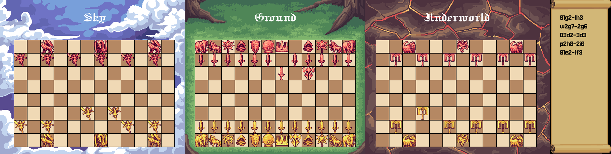

# Dragonchess: A High-Performance AI Framework for Three-Dimensional Chess Variants



## Abstract

Dragonchess is a complete implementation of Gary Gygax's three-dimensional chess variant, developed as a high-performance framework for artificial intelligence research and education. The system provides both a graphical user interface for human play and a headless computational mode capable of executing over 20,000 games per second on commodity hardware. The implementation includes a plugin architecture that enables students and researchers to develop custom AI agents with minimal boilerplate code while maintaining full access to the underlying game state and move generation systems.

## Overview

Dragonchess extends traditional chess into three spatial dimensions with 192 squares arranged across three boards representing different vertical levels. The game introduces 15 distinct piece types with unique movement patterns including inter-level transitions and ranged attacks across vertical space. This complexity makes Dragonchess an excellent testbed for artificial intelligence algorithms, particularly those dealing with high-dimensional state spaces and complex positional evaluation.

This implementation was developed from the ground up in C++17, beginning as a Python prototype before being completely rewritten for performance. The current system achieves computational throughput suitable for large-scale reinforcement learning experiments, hyperparameter optimization, and tournament-style AI evaluation.

## Architecture

### Core Components

The system architecture separates game logic from presentation and provides multiple execution modes through a unified codebase. The primary components include:

**Game State Management**: The core game engine maintains a complete representation of the 192-square board using efficient bit manipulation for move generation and validation. All piece movements, captures, and special mechanics are implemented according to the original Dragonchess rules including three-dimensional movement, vertical attacks, and piece-specific abilities such as freezing, petrification, and possession.

**Move Generation**: Legal move generation employs precomputed attack patterns for each piece type at each board position. The system generates moves for all piece types including those with complex movement rules such as the Oliphant (similar to a rook but with vertical restrictions), the Unicorn (combining diagonal and vertical movement), and the Basilisk (with petrifying attacks). Move validation accounts for piece pinning, check conditions, and three-dimensional threat assessment.

**AI Framework**: The artificial intelligence subsystem provides an abstract base class that all AI agents extend. Built-in implementations include random move selection, greedy material-maximizing agents, and full minimax search with alpha-beta pruning capable of evaluating positions to arbitrary depth. The evaluation function incorporates material balance, positional factors, king safety, and board control across all three levels.

**Plugin System**: The plugin architecture uses dynamic library loading to allow external AI implementations to be loaded at runtime. Student-developed agents need only implement a single method (move selection) while inheriting helper functions for legal move generation, position evaluation, and board state queries. This design significantly reduces the barrier to entry for educational applications while maintaining the performance characteristics necessary for serious research.

**Rendering System**: The graphical interface uses SDL2 for cross-platform compatibility and renders all three board levels simultaneously with visual indicators for piece movement ranges, available captures, and check conditions. The rendering pipeline is decoupled from game logic allowing the same codebase to operate in both graphical and headless modes without modification.


## Technical Implementation

### Board Representation

The game state uses a linear array representation where each of the 192 squares is indexed sequentially. The three levels (Sky, Ground, Cavern) occupy indices 0-63, 64-127, and 128-191 respectively. Within each level, squares follow standard chess indexing with rank 0 column 0 at index 0 (or 64, or 128 for lower levels).

Piece representation uses signed 16-bit integers where the sign indicates color (positive for Gold, negative for Scarlet) and the absolute value encodes piece type. This allows efficient piece identification and color checking through simple arithmetic operations rather than multiple conditional branches.

### Move Generation Algorithm

Legal move generation operates in two phases. First, pseudo-legal moves are generated based purely on piece movement patterns without consideration of whether the move would leave the moving player's king in check. Second, each pseudo-legal move is validated by actually executing it on a temporary board copy and checking whether the king is under attack in the resulting position.

This approach trades some computational overhead for implementation simplicity and correctness. For the plugin system, pre-validated legal move lists are provided to student implementations, ensuring that even naive move selection algorithms cannot make illegal moves.

### Evaluation Function

The position evaluation function used by the greedy and minimax-based agents operates on several factors:

**Material Balance**: Each piece type has an assigned value roughly corresponding to its strategic worth. The king has infinite value (checkmate condition), while other pieces range from value 2 (pawns, elementals, sylphs) to value 6 (paladins). The evaluation sums material for each side and returns the difference.

**Positional Factors**: Additional adjustments account for piece placement including central control on the ground level, piece development (advancing from starting positions), and king safety (penalties for early king movement). These factors are weighted less heavily than raw material but provide tiebreaking for otherwise equal positions.

**Three-Dimensional Control**: Special consideration is given to pieces that effectively control vertical space, as three-dimensional threats are harder to defend against than planar ones. Pieces with inter-level movement capabilities receive modest bonuses for occupying positions that maximize their vertical control.

### Plugin Interface

The SimpleAI base class provides student implementations with the following interface:

```cpp
class SimpleAI {
protected:
    virtual std::optional<Move> choose_move() = 0;
    
    std::vector<Move> get_legal_moves() const;
    std::vector<int> get_my_pieces() const;
    std::vector<int> get_enemy_pieces() const;
    int evaluate_move(const Move& move) const;
    int evaluate_position() const;
    // Additional helper methods...
};
```

Student implementations override only the `choose_move()` method, implementing their strategy using the provided helper functions. The factory pattern enables runtime loading:

```cpp
extern "C" SimpleAI* create_ai(Game& game, Color color) {
    return new StudentBot(game, color);
}
```

Plugins compile to shared libraries (.so files on Linux) and are loaded via dlopen/dlsym calls, allowing the main executable to remain unchanged while testing different AI implementations.


## Compilation and Deployment

### Build Requirements

The system requires a C++17-compliant compiler (GCC 7+, Clang 5+, MSVC 2017+) and CMake 3.15 or later for build configuration. The graphical interface depends on SDL2, SDL2_image, and SDL2_ttf libraries which must be available on the system. For headless operation, only the compiler and standard library are required.

### Building from Source

```bash
cmake -B build -DCMAKE_BUILD_TYPE=Release
cmake --build build --parallel
```

The build process generates two executables: `dragonchess` (the main program) and `test_dragonchess` (unit tests for move generation and game logic). The parallel build option leverages multiple cores to reduce compilation time.

### Plugin Development

Student plugins require only four source files from the main project for compilation:

```bash
g++ -std=c++17 -fPIC -O3 -I../src -shared \
    ../src/simple_ai.cpp ../src/bitboard.cpp \
    ../src/moves.cpp ../src/game.cpp \
    student_bot.cpp -o student_bot.so
```

The resulting shared library can be loaded at runtime using command-line options:

```bash
./dragonchess --headless --mode tournament --games 1000 \
    --gold-ai-plugin student_bot.so \
    --scarlet-ai alphabeta --scarlet-depth 3 \
    --output-csv results.csv
```

This workflow minimizes the build complexity for students while maintaining access to the full game engine functionality.

## Command-Line Interface

The headless mode provides comprehensive control over execution parameters:

**Mode Selection**: Three primary modes are available: tournament (repeated games between two opponents), benchmark (performance testing), and evaluation (comparing multiple agents in round-robin format).

**AI Configuration**: Both players can be configured independently with AI type, search depth (for minimax variants), and custom naming. Plugin-based agents are specified using file paths to their compiled shared libraries.

**Output Options**: Game results can be exported to CSV or JSON formats with detailed statistics including move counts, game duration, final piece counts, and checkmate detection. The quiet mode suppresses progress output for batch processing.

**Execution Control**: Thread count can be specified manually or automatically detected. Maximum game length limits prevent runaway games in draw positions. Verbose mode provides detailed logging for debugging purposes.


## Conclusion

This implementation of Dragonchess provides a complete framework for artificial intelligence research and education in the domain of complex board games. The combination of high computational performance, flexible plugin architecture, and comprehensive documentation enables applications ranging from undergraduate AI courses through advanced reinforcement learning research. The open architecture invites extension and modification while the included example implementations provide clear reference points for developers at all skill levels.

## Repository Structure

```
dragonchess/
├── src/                      # Core engine implementation
│   ├── game.cpp/h           # Game state and rules
│   ├── moves.cpp/h          # Move generation
│   ├── bitboard.cpp/h       # Board representation
│   ├── ai.cpp/h             # Built-in AI implementations
│   ├── simple_ai.cpp/h      # Plugin base class
│   ├── ai_plugin.cpp/h      # Dynamic library loader
│   ├── headless.cpp/h       # Headless execution mode
│   ├── main.cpp             # Entry point and CLI
│   └── ...                  # Rendering and UI components
├── examples/                 # Educational plugin examples
│   ├── random_bot.cpp       # Baseline implementation
│   ├── material_bot.cpp     # Material evaluation
│   ├── tactical_bot.cpp     # Tactical awareness
│   ├── positional_bot.cpp   # Positional evaluation
│   ├── aggressive_bot.cpp   # Aggressive strategy
│   ├── student_bot.cpp      # Template for student work
│   ├── Makefile             # Build automation
│   ├── run_tournament.sh    # Tournament automation
│   └── README.md            # Examples documentation
├── assets/                   # Graphics and fonts
├── CMakeLists.txt           # Build configuration
├── .gitignore               # Version control exclusions
└── README.md                # This document
```

## Additional Documentation

- **HEADLESS_MODE.md**: Comprehensive guide to headless execution, CLI options, and batch processing
- **PLUGIN_SYSTEM.md**: Technical documentation for the plugin architecture and API reference
- **STUDENT_GUIDE.md**: Tutorial for developing AI agents with progressive examples
- **examples/README.md**: Detailed description of provided example implementations and tournament results

## License

This software is provided for educational and research purposes. Users are free to modify, extend, and redistribute the code with attribution. No warranty is provided for correctness, performance, or fitness for any particular purpose.

## References

Gygax, G. (1985). *Dragonchess*. TSR, Inc.

The complete rules of Dragonchess as originally published have been implemented faithfully in this system with the exception of time control mechanisms which are irrelevant for computer-vs-computer play.
